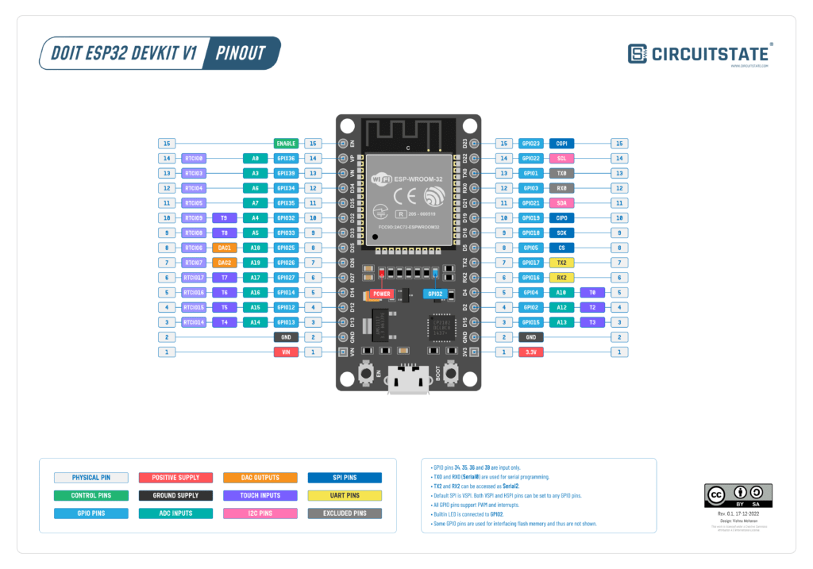

# เตรียมเครื่องสำหรับพัฒนา IoT

ก่อนการพัฒนา IoT จะต้องทำการติดตั้ง โปรแกรม สำหรับสร้าง Environment สำหรับการพัฒนาโปรแกรมด้าน IoT

##  1. Chocolatey  
Chocolatey เป็นเครื่องมือการจัดการซอฟต์แวร์ package management แบบฟรีสำหรับ Windows เราสร้างติดตั้งโปรแกรมต่างผ่านทาง Repository ของ Chocolatey  <https://chocolatey.org/install>


เปิด Powershell ด้วยสิทธิ Administrator

```sh
> Set-ExecutionPolicy AllSigned

> Set-ExecutionPolicy Bypass -Scope Process

> Set-ExecutionPolicy Bypass -Scope Process -Force; [System.Net.ServicePointManager]::SecurityProtocol = [System.Net.ServicePointManager]::SecurityProtocol -bor 3072; iex ((New-Object System.Net.WebClient).DownloadString('https://community.chocolatey.org/install.ps1'))

```
ตัวอย่างหน้าจอ


Reboot เครื่อง  หลังจากนั้น ให้ทำการติดตั้ง package จาก Powershell ดังนี้
- rsync
- wget
- python
- nodejs
- make

```sh
> choco install rsync wget python nodejs
> choco install make
```

ตัวอย่างหน้าจอ


## 2. Arduino IDE 2

Arduino IDE เป็น Editor สำหรับการพัฒนาโปรแกรม ด้วย Arduino Framework
<https://www.arduino.cc/en/software>  และ Download MSI installer 


กด Just Download


ดำเนินการติดตั้ง โปรแกรมแบบ ปรกติ


เปิดโปรแกรม Arduino IDE และ ไปยัง เมนู File > Preferences เพื่อทำการตั้งค่า


เพิ่มเติม บอร์ด ESP32 ให้แก่ Arduino IDE เพื่อให้สามารถใช้ สามารถพัฒนา iot ร่วมกับ ESP32 บอร์ดได้


เพิ่ม link Additional Boards Managers
```
https://espressif.github.io/arduino-esp32/package_esp32_index.json
```
```admonish
Ref อ้างอิง Code สำหรับ ESP32 Core Arduino  <https://github.com/espressif/arduino-esp32>
```

### ข้อมูลสำหรับ บอร์ด ตระกูล ESP32 
| **SoC**  | **Stable** | **Development** |                                           **Datasheet**                                           |
|----------|:----------:|:---------------:|:-------------------------------------------------------------------------------------------------:|
| ESP32    |     Yes    |       Yes       |    [ESP32](https://www.espressif.com/sites/default/files/documentation/esp32_datasheet_en.pdf)    |
| ESP32-S2 |     Yes    |       Yes       | [ESP32-S2](https://www.espressif.com/sites/default/files/documentation/esp32-s2_datasheet_en.pdf) |
| ESP32-C3 |     Yes    |       Yes       | [ESP32-C3](https://www.espressif.com/sites/default/files/documentation/esp32-c3_datasheet_en.pdf) |
| ESP32-S3 |     Yes    |       Yes       | [ESP32-S3](https://www.espressif.com/sites/default/files/documentation/esp32-s3_datasheet_en.pdf) |
| ESP32-C6 |     No     |       Yes       | [ESP32-C6](https://www.espressif.com/sites/default/files/documentation/esp32-c6_datasheet_en.pdf) |
| ESP32-H2 |     No     |       Yes       | [ESP32-H2](https://www.espressif.com/sites/default/files/documentation/esp32-h2_datasheet_en.pdf) |


<https://products.espressif.com/#/product-comparison>

## อ้างอิง
[ดูข้อมูลเปรียบเทียบ](./ref/compare_esp1.md)

