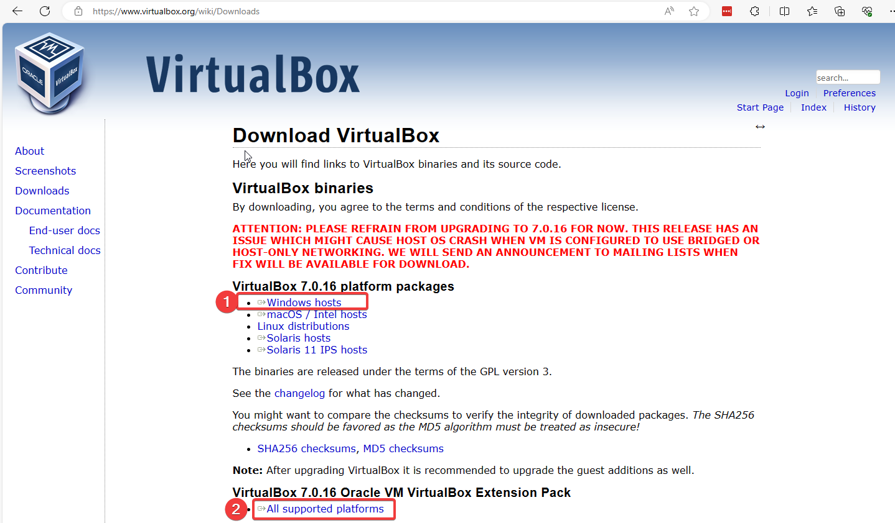
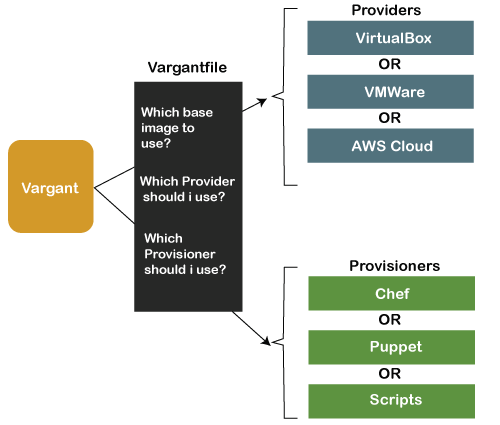
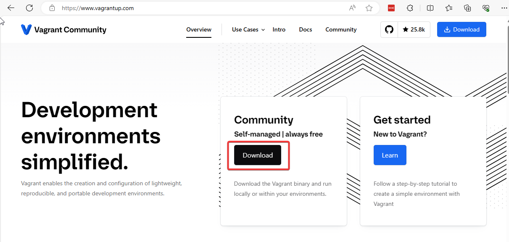
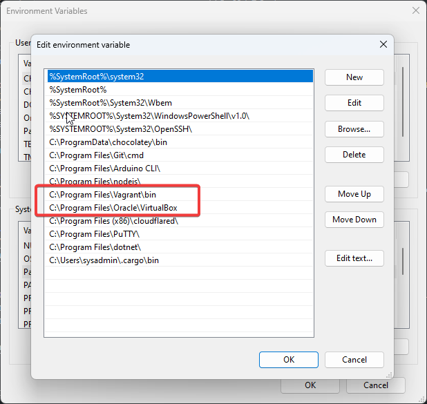
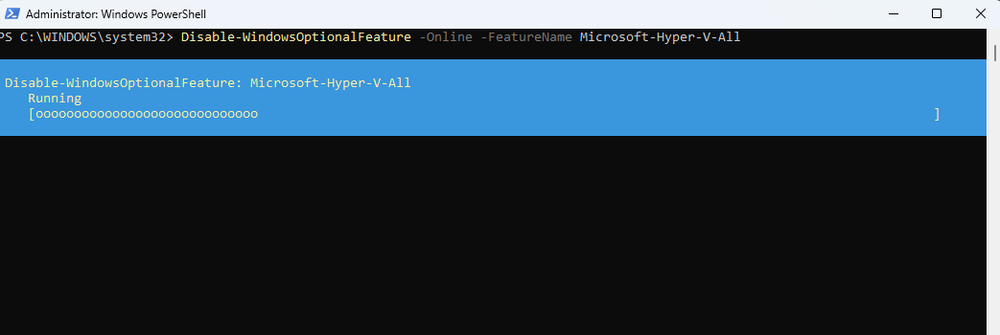
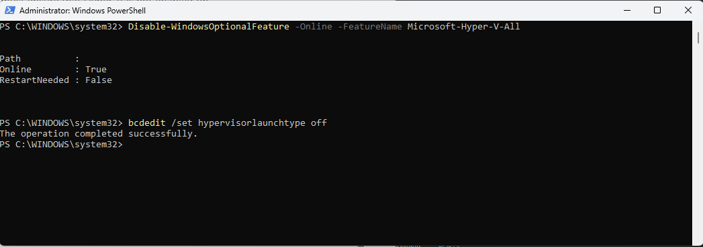
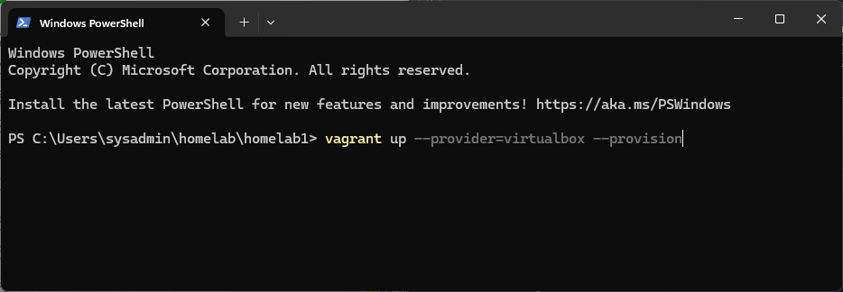
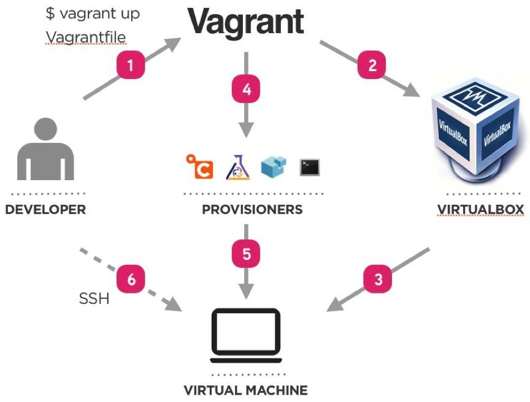

# สร้าง IoT Home lab

การสร้าง IoT home lab เพื่อใช้สำหรับการเรียนรู้และการพัฒนา มีวัดถุประสงค์เพื่อให้การเรียนรู้มีประสิทธิภาพ รวดเร็วไม่เสียเวลาสำหรับการสร้าง Environment โดยการสร้าง Home Lab ในบทนี้จะเป็นการสร้างบน Windows 10/11 มีขั้นตอนดังต่อไปนี้
1. ติดตั้ง Virtaulbox version ล่าสุด
1. ติดตั้ง Vagrant
1. ปิด Service HyperV บน Windows
1. สร้าง Vagrantfile เพื่อสร้าง lab

## 1. ติดตั้ง Virtualbox
ไปยัง <https://www.virtualbox.org/wiki/Downloads> เพื่อทำการ Download โปรแกรม virtualbox และ Extension Pack


## 2. ติดตั้ง Vagrant 
Vagrant คืออะไร



ไปยัง <https://www.vagrantup.com/> ให้ Download Community Version


## ตั้งค่า Path 
เมื่อตั้งตั้งโปรแกรมในข้อ 1,2 เรียบร้อยแล้วให้ทำการเพิ่ม path  ของ โปรแกรมเพื่อให้สามารถใช้งานผ่านทาง Command Line ได้
- เพิ่ม Path ของ virtualbox ไปยัง Environment Variable (C:\Program Files\Oracle\VirtualBox)
- เพิ่ม Path ของ vagrant ไปยัง Environment Variable  (C:\Program Files\Vagrant\bin)


กดเลือกบรรทัด path และกดปุ่ม New เพื่อเพิ่มเติมค่า


## ปิด hyperv service บน Windows
เปิด Powershell ในโหมด Administrator

```sh
> Disable-WindowsOptionalFeature -Online -FeatureName Microsoft-Hyper-V-All
```

และ
```sh
> bcdedit /set hypervisorlaunchtype off
```


## ติดตั้ง Home lab

เรียนรู้พื้นฐานการสร้าง Home Lab ด้วยสร้าง Virtual Host บน virtualbox ด้วยการใช้งานคำสั่ง vagrant 
- สร้าง Folder สำหรับติดตั้ง Homelab เช่น thingsboard
- ภายใน folder thingsboard ประกอบด้วย File 2 File ดังนี้ 
    - Vagrantfile  ระบุคำสั่งสำหรับการสร้าง VM (เรียกว่า Creation)
    - bootstrap.sh  ระบุคำสั่งที่ทำงานภายใน VM (เรียกการ Provision)

### ตัวอย่าง สร้าง Debian server   
สร้าง VM ด้วย Debian 12 และหลังจากสร้าง VM ก็จะทำการติดตั้ง docker engine
- สร้าง Folder homelab ด้วย คำสั่ง mkdir
```sh
>mkdir homelab
```
- หลังจากนั้น ให้ Download ไฟล์ [homelab1.zip](../assets/zip/homelab1.zip) ไปไว้ folder homelab และทำการแตก zip ให้เรียบร้อย
- และใช้ Terminal เปิดไปยัง folder homelab1 

- run คำสั่ง vagrant ดังนี้
```sh
vagrant up --provision=virtualbox --provision
```

ตัวอย่างหน้าจอ


### ขั้นตอนการทำงานเบื้องหลัง


```admonish example 
Code Review
```

File **Vagrantfile** เป็นภาษา ruby ทำหน้าที่เป็น Template เพื่อส่งต่อให้แก่ คำสั่ง Vagrant นำไปสร้าง VM บน Virtualbox


```ruby 
Vagrant.configure("2") do |config|
  config.vm.box = "generic/debian12"
  config.vm.network "private_network", ip: "192.168.56.10"
  config.vm.network "forwarded_port", guest:2375 , host: 2375
  config.vm.network "public_network", bridge: "Intel(R) Wireless-AC 9560 160MHz", ip: "192.168.1.10"
  config.vm.synced_folder ".", "/vagrant", type: "rsync"
  config.vm.provider "virtualbox" do |vb|
    vb.customize [
      "modifyvm", :id,
      "--nested-hw-virt", "on",
      "--memory", "2048",
      "--paravirtprovider", "hyperv", 
      "--cpus", "2"
    ]
  end

  #config.vm.provision "shell" , path: "bootstrap.sh"
end
```

File **bootstrap.sh** เป็น Bash script ไว้สำหรับ Run ใน Debian สำหรับการติดตั้ง Docker , Docker compose

```sh
#!/bin/bash

  echo "[ ] Start vagrant provisioning"

  # Add Docker's official GPG key:
  sudo apt update && sudo apt upgrade -y && sudo apt autoremove –y
  sudo apt --fix-broken install -y
  sudo apt-get install ca-certificates curl -y  
  sudo apt-get install openssh-server -y
  sudo apt-get install wget tree -y
  sudo apt install \
  apparmor \
  cifs-utils \
  curl \
  dbus \
  jq \
  libglib2.0-bin \
  lsb-release \
  network-manager \
  nfs-common \
  udisks2 \
  wget -y
  
  sudo curl -fsSL https://download.docker.com/linux/debian/gpg -o /etc/apt/keyrings/docker.asc
  sudo chmod a+r /etc/apt/keyrings/docker.asc

  # Add the repository to Apt sources:
  echo "[ ] install docker "
  echo \
  "deb [arch=$(dpkg --print-architecture) signed-by=/etc/apt/keyrings/docker.asc] https://download.docker.com/linux/debian \
  $(. /etc/os-release && echo "$VERSION_CODENAME") stable" | \
  sudo tee /etc/apt/sources.list.d/docker.list > /dev/null 
  sudo apt update -y
  sudo apt-get install docker-ce docker-ce-cli containerd.io docker-buildx-plugin docker-compose-plugin -y 
  sudo usermod -aG docker vagrant 
  newgrp docker
 
```