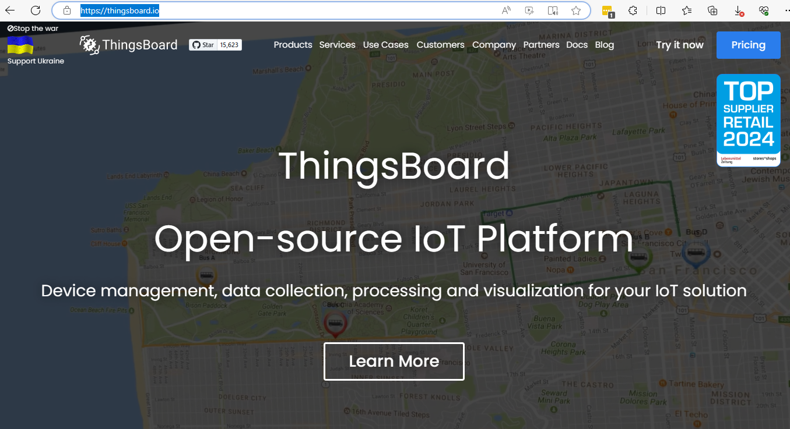
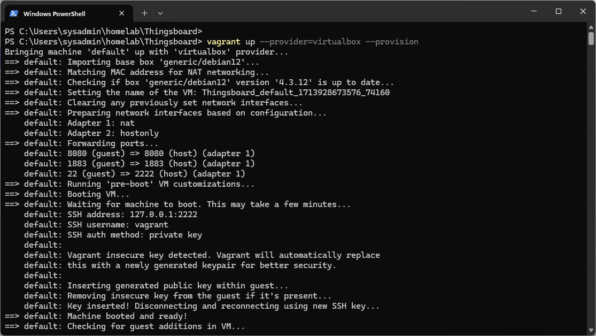
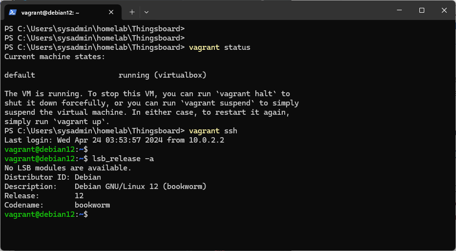
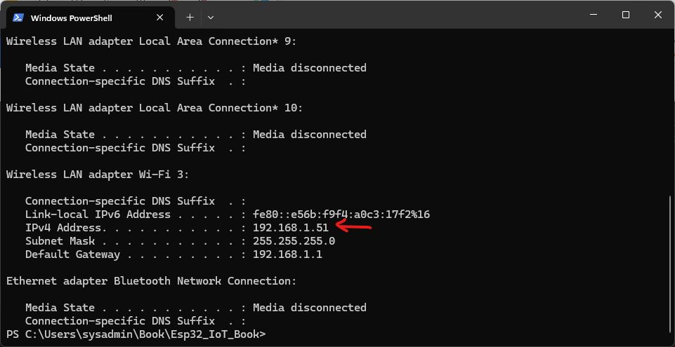
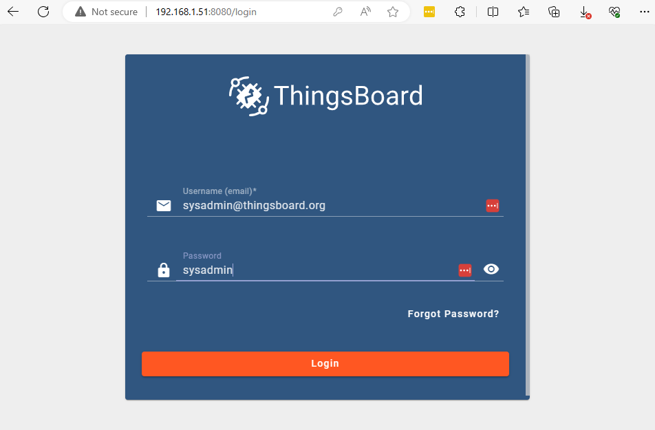
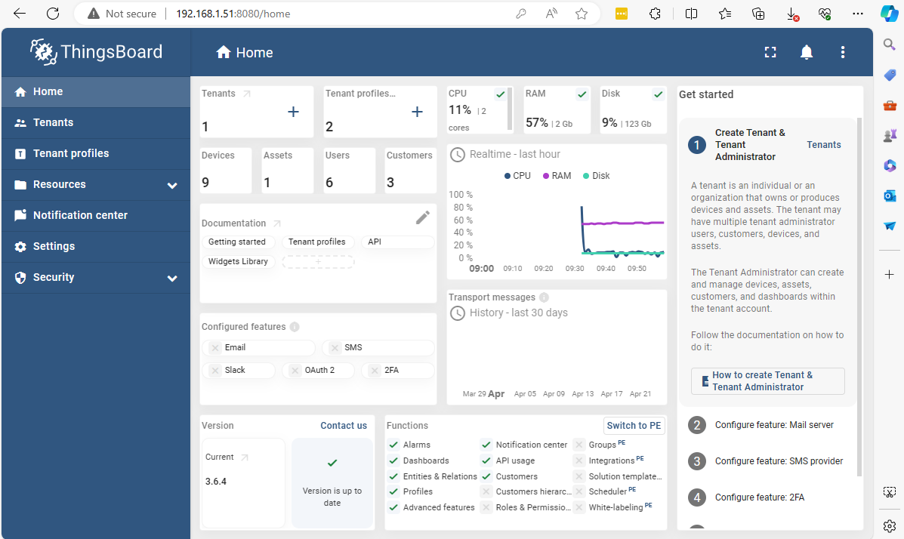

# สร้าง Thinsboard Server
### ตัวอย่าง สร้าง Thingsboard server  

**Thingsboard Server คือ**

Thingsboard Server เป็นแพลตฟอร์ม IoT (Internet of Things) ที่ใช้สำหรับการจัดการและการควบคุมอุปกรณ์ IoT ต่าง ๆ ได้อย่างมีประสิทธิภาพ ซึ่งออกแบบมาเพื่อให้สามารถจัดการกับอุปกรณ์ IoT จำนวนมากได้โดยมีการรองรับการส่งข้อมูลแบบ real-time อย่างมีประสิทธิภาพด้วยความปลอดภัยสูงสุด

Thingsboard Server มีความสามารถที่สำคัญดังนี้:

1. **การจัดการอุปกรณ์ (Device Management)**: Thingsboard สามารถรับข้อมูลจากอุปกรณ์ IoT และจัดการกับอุปกรณ์เหล่านั้นได้ รวมถึงการเชื่อมต่อ, การลงทะเบียน, การติดตามสถานะ, และการจัดการอื่น ๆ ของอุปกรณ์ IoT.

2. **การจัดเก็บข้อมูล (Data Persistence)**: Thingsboard ช่วยในการจัดเก็บข้อมูลที่ได้รับจากอุปกรณ์ IoT อย่างปลอดภัยและเป็นระบบ โดยสามารถบันทึกข้อมูลได้ในรูปแบบที่ยืดหยุ่น และสามารถเข้าถึงข้อมูลได้จากหน้าต่างสำหรับการวิเคราะห์.

3. **การแสดงผลและการจัดเก็บข้อมูล (Visualization and Dashboards)**: Thingsboard มีความสามารถในการสร้างและแสดงข้อมูลผ่านทางกราฟและตัวชี้วัดต่าง ๆ ที่เกี่ยวข้องกับอุปกรณ์ IoT ซึ่งสามารถเข้าถึงผ่านทางแผงควบคุมหรือ Dashboards ที่กำหนดเอง.

4. **การจัดการกฎและการควบคุม (Rules Engine and Control)**: Thingsboard มีกลไกในการตั้งกฎและการควบคุมที่ทำให้ผู้ใช้สามารถกำหนดการกระทำต่าง ๆ ภายในระบบ IoT ตามเงื่อนไขที่กำหนดได้.

5. **ความปลอดภัย (Security)**: Thingsboard มีการป้องกันความปลอดภัยที่มีประสิทธิภาพ เช่น การรับรองตัวตนและการเข้ารหัสข้อมูล เพื่อปกป้องข้อมูลของอุปกรณ์ IoT และข้อมูลการใช้งาน.

Thingsboard Server เป็นโปรเจกต์แบบ (open-source) ซึ่งทำให้มีความยืดหยุ่นในการปรับแต่งตามความต้องการขององค์กร และมีชุมชนที่พร้อมให้การสนับสนุนและพัฒนาเพิ่มเติมอย่างต่อเนื่อง

<https://thingsboard.io/>
 


สร้าง Thingsboard Server บน Debian 12 และหลังจากสร้าง VM ก็จะทำการติดตั้ง docker engine

- หลังจากนั้น ให้ Download ไฟล์ [Thingsboard.zip](../assets/zip/Thingsboard.zip) ไปไว้ folder homelab และทำการแตก zip ให้เรียบร้อย
- Run คำสั่ง vagrant

```sh
vagrant up --provision=virtualbox --provision
```
### ผลลัพท์



- Run คำสั่ง ```vagrant ssh```, ```vagrant up```

### ผลลัพท์


```admonish example 
Code Review
```

File **Vagrantfile** สำหรับ lab นี้จะสร้าง VM จาก Debian 12 (Box) และมีการ Run Script เพื่อติดตั้ง Docker Engine โดยใช้รูปแบบการ Run แบบ inline script และ จะใช้ คำสั่ง Docker compose เพื่อสร้าง containers

```ruby 
# -*- mode: ruby -*-
# vi: set ft=ruby :

# All Vagrant configuration is done below. The "2" in Vagrant.configure
# configures the configuration version (we support older styles for
# backwards compatibility). Please don't change it unless you know what
# you're doing.

$script = <<-SCRIPT
  # genkey
  # Add Docker's official GPG key:
  sudo apt-get install ca-certificates curl -y  
  sudo apt-get install openssh-server -y
  systemctl restart sshd.service
  
  sudo curl -fsSL https://download.docker.com/linux/debian/gpg -o /etc/apt/keyrings/docker.asc

  sudo chmod a+r /etc/apt/keyrings/docker.asc

  # Add the repository to Apt sources:
  echo \
  "deb [arch=$(dpkg --print-architecture) signed-by=/etc/apt/keyrings/docker.asc] https://download.docker.com/linux/debian \
  $(. /etc/os-release && echo "$VERSION_CODENAME") stable" | \
  sudo tee /etc/apt/sources.list.d/docker.list > /dev/null 

  sudo apt update -y
  # Install Docker Compose
  sudo apt-get install docker-ce docker-ce-cli containerd.io docker-buildx-plugin docker-compose-plugin -y 
  usermod -aG docker vagrant 
  
  # create folder for moute data 
  sudo -u vagrant mkdir -p /home/vagrant/.thingsboard-data && sudo chown -R 799:799  /home/vagrant/.thingsboard-data
  sudo -u vagrant mkdir -p /home/vagrant/.thingsboard-db && sudo chown -R 799:799 /home/vagrant/.thingsboard-db
  sudo -u vagrant mkdir -p /home/vagrant/.thingsboard-logs && sudo chown -R 799:799 /home/vagrant/.thingsboard-logs
  
  # Run docker compose
  sudo -u vagrant docker compose  -f /vagrant/docker-compose.yml  up -d

SCRIPT
Vagrant.configure("2") do |config|
  config.vm.box = "generic/debian12"
  config.vm.network "private_network", ip: "192.168.33.10"
  config.vm.network "forwarded_port", guest:8080 , host: 8080
  config.vm.network "forwarded_port", guest:1883 , host: 1883
  config.vm.synced_folder ".", "/vagrant", type: 'rsync'
  
  config.vm.provider "virtualbox" do |vb|
    vb.customize [
      "modifyvm", :id,
      "--nested-hw-virt", "on",
      "--memory", "2048",
      "--paravirtprovider", "hyperv", 
      "--cpus", "2"
    ]
  end
  config.vm.provision "shell" , inline: $script
end

```

File **docker-compose.yml** เป็น Bash script ไว้สำหรับ Run ใน Debian สำหรับการติดตั้ง Docker , Docker compose

```yaml
services:
  thingsboard:
    restart: unless-stopped
    image: "thingsboard/tb-postgres"
    expose:
      - "8080"
    ports:
      - "8080:9090"
      - "1883:1883"
      - "7070:7070"
      - "5683-5688:5683-5688/udp"
    environment:
      TB_QUEUE_TYPE: in-memory
      SPRING_DATASOURCE_URL: jdbc:postgresql://postgres:5432/thingsboard
      SPRING_DATASOURCE_PASSWORD: postgres
      SPRING_DATASOURCE_USERNAME: postgres
    volumes:
      - /home/vagrant/.thingsboard-data:/data
      - /home/vagrant/.thingsboard-logs:/var/log/thingsboard
    links:
      - postgres
    depends_on:
      - postgres

  postgres:
    restart: unless-stopped
    image: "postgres:15"
    ports:
      - "5432"
    environment:
      POSTGRES_DB: thingsboard
      POSTGRES_PASSWORD: postgres
    volumes:
      - /home/vagrant/.thingsboard-data/db
```

- เปิด terminal พิมพ์ คำสั่ง  ipconfig เพื่อดูค่า ip ที่ได้รับจาก Router



- เปิด browser  http://<ip_address>:8080


```admonish
Default system administrator account:

    login - sysadmin@thingsboard.org
    password - sysadmin

Default demo tenant administrator account:

    login - tenant@thingsboard.org.
    password - tenant.

Demo tenant customers:

    Customer A user: customerA@thingsboard.org.

    Customer B user: customerB@thingsboard.org.

    Customer C user: customerC@thingsboard.org.

all users have “customer” password.
```
หลังจาก Login จะได้หน้า Dashboard



### คำสั่ง Vagrant

```admonish info
- คำสั่ง พื้นฐาน สำหรับ บริหารจัดการ VB
    - vagrant up --provider=virtualbox --provision
    - vagrant halt
    - vagrant up
    - vagrant destroy
- คำสั่ง สำหรับการ ssh เข้าไปใน VM
    - ตรวจสอบ ssh config
        - vagrant ssh-config
    - vagrant ssh
```

ต่อไปจะเรียนรู้การใช้งาน Thingsboard iot gateway