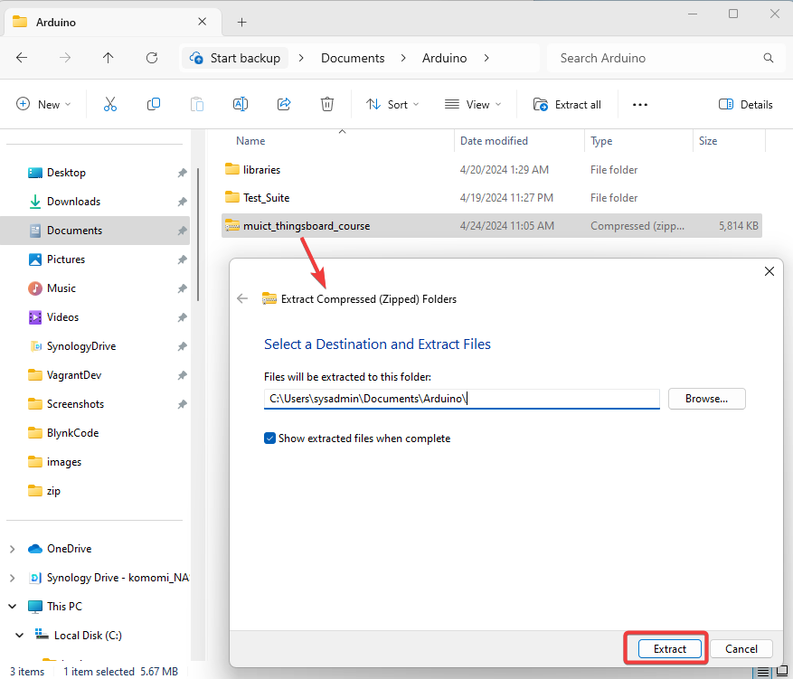
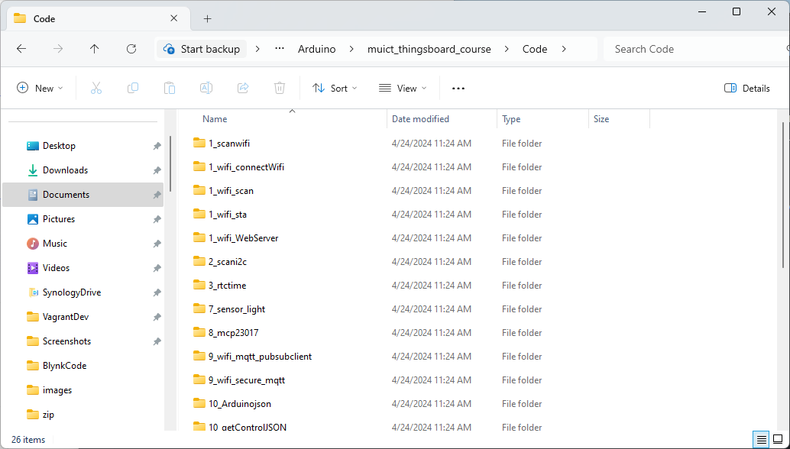
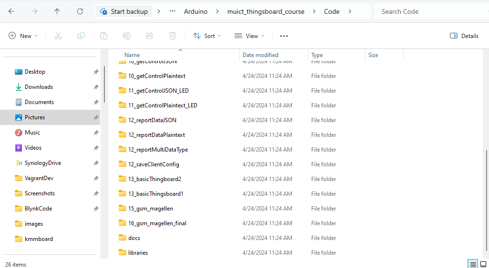
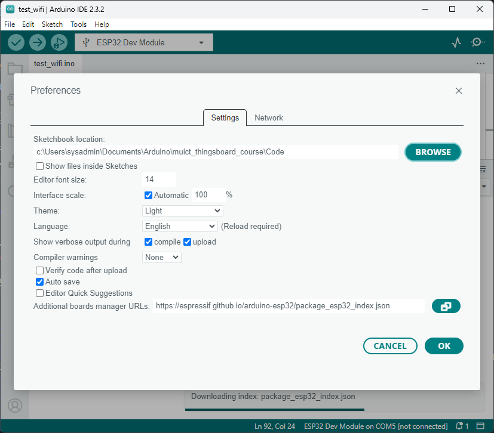
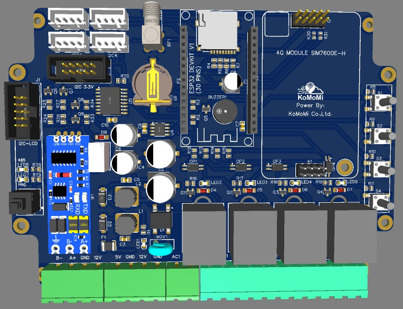

# เตรียม Workshop

- ขั้นตอนการเตรียม workshop  หลังจากที่ได้ Download และติดตั้ง Arduino IDE และ Driver เรียบร้อยแล้ว ก็ได้ ทำการ Download file [muict_thingsboard_cource.zip](../assets/zip/muict_thingsboard_course.zip) ไปไว้ใน Folder ```C:\Users\<username>\Documents\Arduino``` และ แตกไฟล์ให้เรียบรอย   



หลังจาก นั้นให้เปิด Explorer ไปยัง ```C:\Users\<username>\Documents\Arduino\muict_thingsboard_course\Code```



### การตั้งค่า library ของโปรเจค

- ตั้งค่า library ไปยัง ```C:\Users\<username>\Documents\Arduino\muict_thingsboard_course\Code``` เนื่องจาก ภายใน Folder ดังกล่าว ได้มี library เตรียมไว้แล้ว สามารถ compile และ upload code ได้แลยทันที



- เปิด โปรแกรม Arduino IDE ไปยังเมนู Files > Preferences และเปลี่ยน ตำแหน่งของ Location ดังนี้



การเรียนรู้ workshop ก็จะดำเนิน เรียนรู้ไปเป็นลำดับ ดังนี้
- ทำความเข้าใจ Code
- Library ที่ใช้ในแต่ละบท
- Upload Code ไปยัง Board ในที่การเรียบรู้สามารถใช้งาน Board ในตระกูล ESP32 ได้ตามปรกติทั้งไป แต่ในการเรียบรู้ในบทเรียน จะใช้งาน ESP32 Dev kit V1 ร่วมกับ Extension Shild ของ บริษัท komomi



## เอกสารประกอบ อุปกรณ์
[คู่มือการใช้งาน ของ ฺboard](../assets/kmmboard/User%20Manual%20KMM-SmartFarmV3-IoT-4G.pdf)